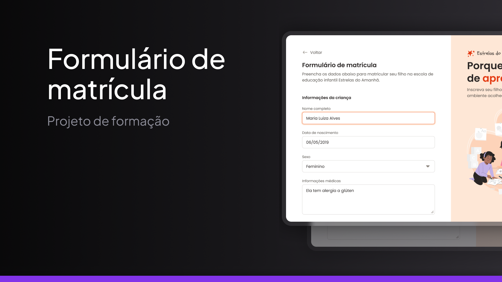

<h1 align="center"> Forms page </h1>

Uma página de cadastro para uma escola fictícia feita como forma de estudos do curso Fullstack da Rocketseat

<a href="https://guilhermedkdk.github.io/rocket-forms-page/">🔗 Live Preview</a>&nbsp;&nbsp;&nbsp;|&nbsp;&nbsp;&nbsp;
<a href="#-tecnologias">🚀 Tecnologias</a>&nbsp;&nbsp;&nbsp; |&nbsp;&nbsp;&nbsp;&nbsp;
<a href="#-projeto">💻 Projeto</a>&nbsp;&nbsp;&nbsp;|&nbsp;&nbsp;&nbsp;
<a href="#-aprendizados">📚 Aprendizados</a>

## 🚀 Tecnologias

Esse projeto foi desenvolvido com as seguintes tecnologias:

- HTML e CSS
- Git e Github
- FIGMA

## 💻 Projeto

A "Forms Page" foi um mini projeto do curso Fullstack da Rocketseat no módulo "Avançando HTML e CSS". Nele, trabalhei com formulários em HTML, utilizando elementos como inputs, labels, select e fieldset para criar uma estrutura funcional e organizada.

## 📚 Aprendizados

Este projeto foi feito dentro do curso de Fullstack no módulo "Avançando HTML e CSS" da Rocketseat.
Nele pude consolidar os conhecimentos sobre:

### HTML
- Forms
- Inputs
- Label
- Select
- Fieldset
